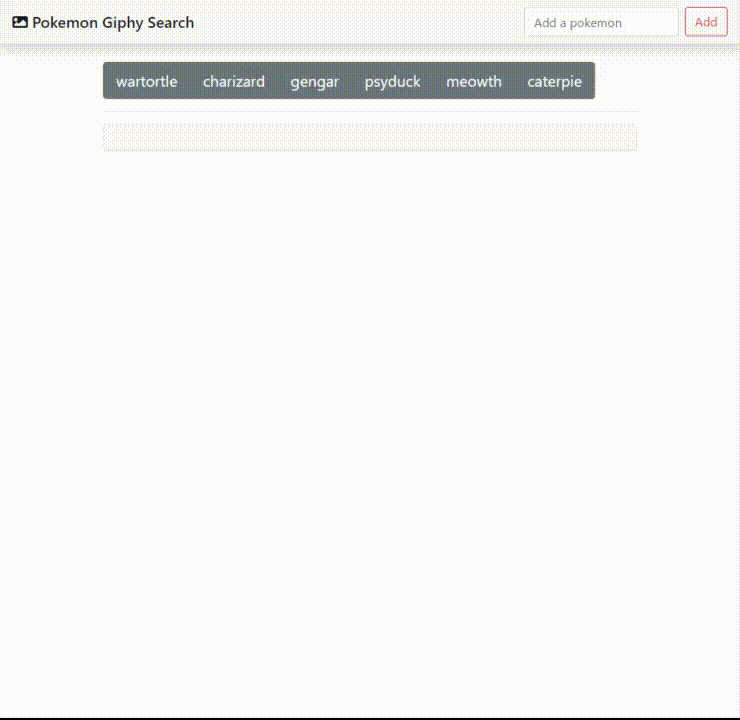
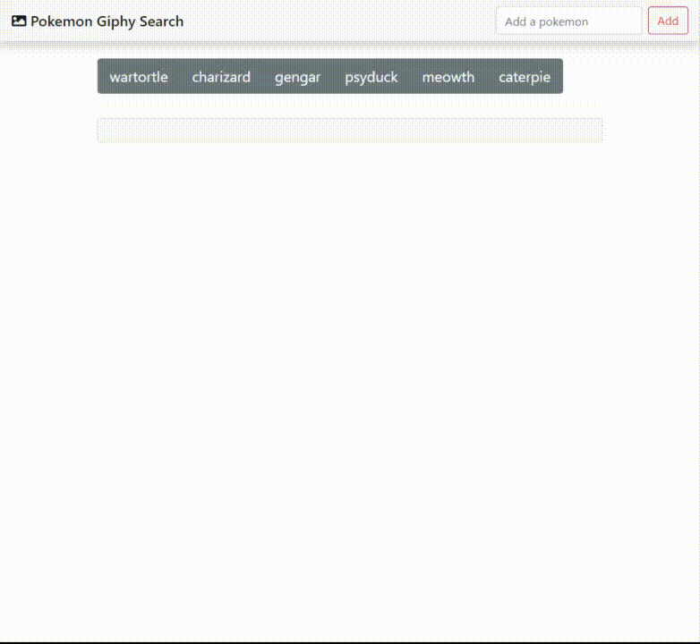
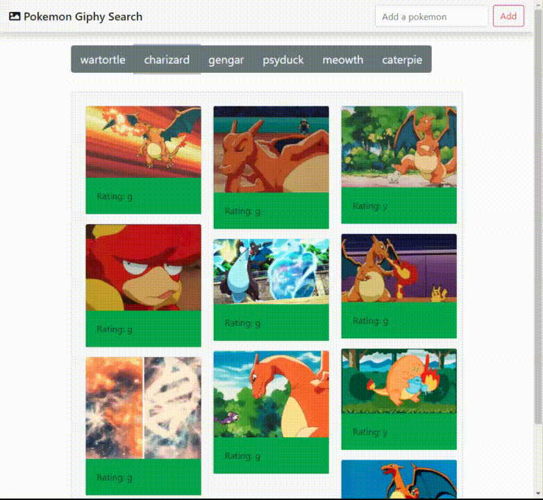

# GifTastic
This app uses the GIPHY API to make a dynamic web page that populates with gifs of your choice.
URL: https://winpildeu.github.io/GifTastic/

## What this does:

### 1. Add buttons that can be dynamically shown to a button list

### 2. When you click a button, it searches the Giphy API for the pokemon of your choosing and will return 10 results

### 3. When you click an image, it will begin to move. When you click it again, the animation will stop.

